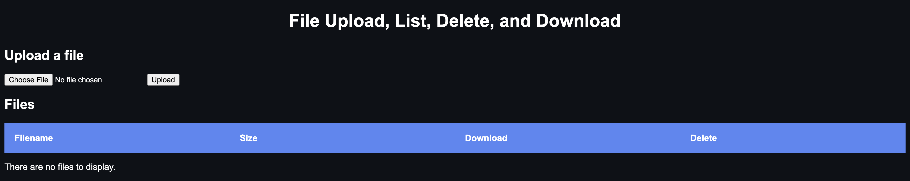

# HTTP Server
http server that you can upload, list and download files from.
Uses Python, Flask, sqlite3, HTML5, CSS.

## Resources
https://readthedocs.org/projects/flask-dev/downloads/pdf/latest/
https://flask.palletsprojects.com/en/1.1.x/patterns/fileuploads/
https://flask.palletsprojects.com/en/1.1.x/patterns/sqlite3/
https://dev.mysql.com/doc/mysql-tutorial-excerpt/5.7/en/example-auto-increment.html

 
### Preview

